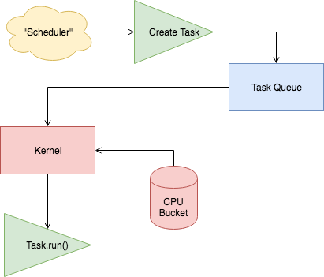

# FFS (Subject to Change)

FFS is a simple screeps operating system that takes an opinionated approach on fundamental tasks and processes that should be ran per cycle. It's currently self-sufficient up to RC3, but does need some love regarding future RC Levels and Rooms.

## Basic Usage

You will need:

 - [Node.JS](https://nodejs.org/en/download) (>= 8.0.0)
 - A Package Manager ([Yarn](https://yarnpkg.com/en/docs/getting-started) or [npm](https://docs.npmjs.com/getting-started/installing-node))
 - Rollup CLI (Optional, install via `npm install -g rollup`)

Download the latest source [here](https://github.com/screepers/screeps-typescript-starter/archive/master.zip) and extract it to a folder.

Open the folder in your terminal and run your package manager to install install the required packages and TypeScript declaration files:

```bash
# npm
npm install

# yarn
yarn
```

Fire up your preferred editor with typescript installed and you are good to go!

### Rollup and code upload

`rollup -c && cp ./dist/main.js main.js`

## Typings

The type definitions for Screeps come from [typed-screeps](https://github.com/screepers/typed-screeps). If you find a problem or have a suggestion, please open an issue there.

## General Flow
